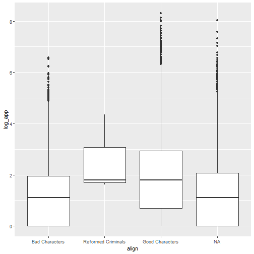
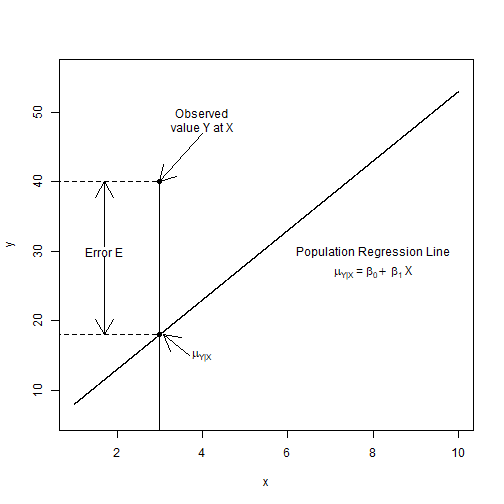
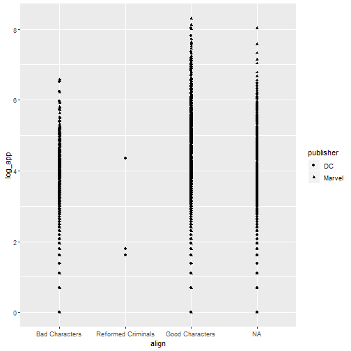
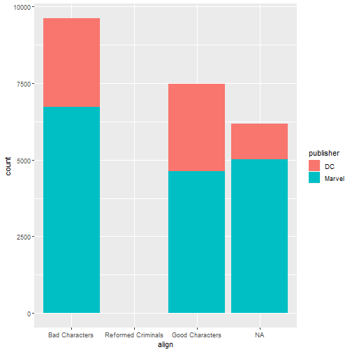
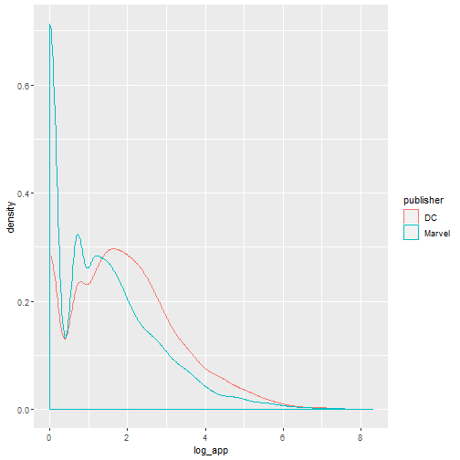
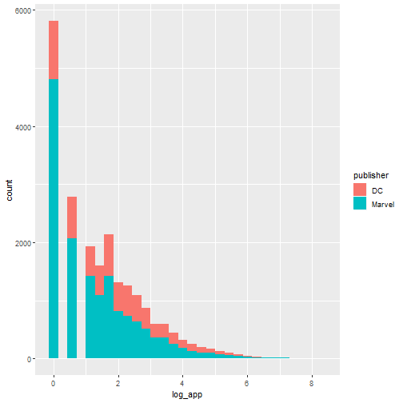

---
title       : Visualization with `ggplot2`
author      : Adam J Sullivan 
job         : Assistant Professor of Biostatistics
work        : Brown University
framework   : io2012        # {io2012, html5slides, shower, dzslides, ...}
highlighter : highlight.js # {highlight.js, prettify, highlight}
hitheme     :  github     # 
widgets     : [mathjax, quiz, bootstrap, interactive] # {mathjax, quiz, bootstrap}
ext_widgets : {rCharts: [libraries/nvd3, libraries/leaflet, libraries/dygraphs]}
mode        : selfcontained # {standalone, draft}
knit        : slidify::knit2slides
logo        : publichealthlogo.png
biglogo     : publichealthlogo.png
assets      : {assets: ../../assets}
---  .segue bg:grey


# `ggplot2`


--- .segue .quote bg:#C0C8CE


<q>  Appropriate graphical analysis may make the conclusions so clearcut that detailed specific analysis is unnecessary </q>

<q>-- David Cox (1978)</q>


--- .class #id

## `ggplot2`


- We will begin our journey into statistical graphics with the package `ggplot2`. 
- This is a package by Hadley Wickham and is part of the tidyverse. 
- It is a very comprehensive and easily adaptable language of graphics. 

--- .class #id

## What can't `ggplot2` do?


- A good place to start might be with what  `ggplot2` cannot do:
  - 3d graphs.
  - Interactive graphs, use `ggvis`
  - DAGs, see `igraph`
- We will now focus on all the things it can do.


--- .class #id


## `ggplot2` components


- `ggplot2` is built off the grammar of graphics with a very intuitive structure. 
- The base graphics built into R require the use of many different functions and each of them seem to have their own method for how to use them.   
- `ggplot2` will be more fluid and the more you learn about it the more amazing of graphics you can create. 

--- .class #id


## `ggplot2` components


- We will get started with the components of every `ggplot2` object:
  1. **data**
  2. **aesthetic mappings** between variables in the data and visual properties.
  3. At least one layer which describes how to render the data. 
    - Many of these are with the `geom_foo()` function. 


--- .class #id


## Our Data

- We will be working with data from [fivethirtyeight](https://fivethirtyeight.com/)
- We can access this by installing the package in R:
  

```r
install.packages("fivethiryeight")
library(fivethirtyeight)
```

--- .class #id

## Our Data

- We will work with data from the article: [Comic Books Are Still Made By Men, For Men And About Men](https://fivethirtyeight.com/features/women-in-comic-books/)
- We can access this data by calling the following:
  

```r
comic_characters
```


--- .class #id

## Comic Characters Data


```
## # A tibble: 23,272 x 16
##    publisher page_id name  urlslug id    align eye   hair  sex   gsm  
##    <chr>       <int> <chr> <chr>   <chr> <ord> <chr> <chr> <chr> <chr>
##  1 Marvel       1678 Spid~ "\\/Sp~ Secr~ Good~ Haze~ Brow~ Male~ <NA> 
##  2 Marvel       7139 Capt~ "\\/Ca~ Publ~ Good~ Blue~ Whit~ Male~ <NA> 
##  3 Marvel      64786 "Wol~ "\\/Wo~ Publ~ <NA>  Blue~ Blac~ Male~ <NA> 
##  4 Marvel       1868 "Iro~ "\\/Ir~ Publ~ Good~ Blue~ Blac~ Male~ <NA> 
##  5 Marvel       2460 Thor~ "\\/Th~ No D~ Good~ Blue~ Blon~ Male~ <NA> 
##  6 Marvel       2458 Benj~ "\\/Be~ Publ~ Good~ Blue~ No H~ Male~ <NA> 
##  7 Marvel       2166 Reed~ "\\/Re~ Publ~ Good~ Brow~ Brow~ Male~ <NA> 
##  8 Marvel       1833 Hulk~ "\\/Hu~ Publ~ Good~ Brow~ Brow~ Male~ <NA> 
##  9 Marvel      29481 Scot~ "\\/Sc~ Publ~ <NA>  Brow~ Brow~ Male~ <NA> 
## 10 Marvel       1837 Jona~ "\\/Jo~ Publ~ Good~ Blue~ Blon~ Male~ <NA> 
## # ... with 23,262 more rows, and 6 more variables: alive <chr>,
## #   appearances <int>, first_appearance <chr>, month <chr>, year <int>,
## #   date <date>
```


--- .class #id

## Comic Characters Data

- We can see the names of the variables by using the `names()` function:


```r
names(comic_characters)
```

```
##  [1] "publisher"        "page_id"          "name"            
##  [4] "urlslug"          "id"               "align"           
##  [7] "eye"              "hair"             "sex"             
## [10] "gsm"              "alive"            "appearances"     
## [13] "first_appearance" "month"            "year"            
## [16] "date"
```


--- .class #id

## `ggplot()` Basics

- We will begin with a basic graph of appearances by alignment


```r
library(ggplot2)
ggplot(data=comic_characters, aes(x=align, y=appearances))
```


--- .class #id

## `ggplot()` Basics


--- .class #id

## `ggplot()` Statement

- We can see that all we have is the basic layout of axis. 
- The data and aes gives us the basic layout. 
- We need `geom_foo()` to make a proper graph. 


--- .class #id

## `geom_point()` Statement

- We can add`geom_point()` to this:


```r
ggplot(data=comic_characters, aes(x=align, y=appearances)) + 
  geom_point()
```


--- .class #id

## `geom_point()` Statement


--- .class #id

## Other graphs

- This graph is not the best use for out data. 
- We could try boxplots instead:
  


```r
ggplot(data=comic_characters, aes(x=align, y=appearances)) + 
  geom_boxplot()
```


--- .class #id

## Other graphs


  


--- .class #id 


## Quick Transformation

- We may be having a hard time seeing this due to the outliers in the data. 
- We can try a log transform. 
- The code below will do this
- By the end of today you will understand this code


```r
comic_characters <- comic_characters %>%
  mutate(log_app = log(appearances))
```


--- .class #id 


## Boxplots Again


```
## Error in FUN(X[[i]], ...): object 'log_app' not found
```




--- .class #id

## Bar Graphs

- We could then consider simple bar graphs
- For example if we wanted to know how many characters of each type there were:
  

```r
ggplot(data=comic_characters, aes(x=align)) + 
  geom_bar()
```
- Note: With bar graphs we only need the x-axis. 

--- .class #id

## Bar Graphs


  


--- .class #id

## Basic Template

```
ggplot(data= <DATA>, aes(x=<X-VARIABLE>, y=<Y-VARIABLE>)) + 
    <GEOM_FUNCTION>()
```

---  .segue bg:grey


# Aesthetics


--- .class #id

## Aesthetics

- The basic aesthetics are mapping the data to the x and y axis. 
- We can also add:
  - `alpha`: makes points transparent to see overlaps better
  - `fill`: Fills objects with color 
  - `color`: Changes color of points or lines.
  - `shape`: Changes spape of points


--- .class #id


## Aesthetics:  `alpha`


```r
ggplot(data=comic_characters, aes(x=align, y=log_app)) + 
  geom_point(aes(alpha=1/100))
```

--- .class #id

## Aesthetics:  `alpha`


```
## Error in FUN(X[[i]], ...): object 'log_app' not found
```


--- .class #id

## Aesthetics:  `alpha`

- It can be hard to see the transparency when they are so close.
- We can set the transparency to a variable


--- .class #id

## YOUR TURN

- Set `alpha=year`
- How does this change things?

--- .class #id

## Aesthetics:  `alpha`


```
## Error in FUN(X[[i]], ...): object 'log_app' not found
```


--- .class #id

## Aesthetics:  `color`

- We can easily change the color of points and lines using `color`


```r
ggplot(data=comic_characters, aes(x=align, y=log_app)) + 
  geom_point(aes(color=publisher))
```


--- .class #id

## Aesthetics:  `color`


```
## Error in FUN(X[[i]], ...): object 'log_app' not found
```



--- .class #id 

## YOUR TURN

- Set `color="blue"`
- How does this change things?


--- .class #id

## Aesthetics: `shapes`

- We can change the shape of points based on different variables.


```r
ggplot(data=comic_characters, aes(x=align, y=log_app)) + 
  geom_point(aes(shape=publisher))
```


--- .class #id

## Aesthetics: `shapes`


```
## Error in FUN(X[[i]], ...): object 'log_app' not found
```




--- .class #id

## Your Turn

- Try using both shape and color. 
- How does this add dimensionality to the graph?


--- .class #id

## Aesthetics: `fill`

- We can fill objects with color as well


```r
ggplot(data=comic_characters, aes(x=align)) + 
  geom_bar(aes(fill="blue"))
```


--- .class #id

## Aesthetics: `fill`

- This doesnt have the same effect as `color`


--- .class #id

## Aesthetics: `fill`

- We can use other variables to add dimensionality


```r
ggplot(data=comic_characters, aes(x=align)) + 
  geom_bar(aes(fill=publisher))
```


--- .class #id

## Aesthetics: `fill`





---  .segue bg:grey

# Geoms

--- .class #id

## Geoms

- There are many `geom_foo()` functions we can use. 
- The Cheatsheet on   `ggplot()` is a good place to start for more. 

--- .class #id

## Other Plots: Density


```
## Error in FUN(X[[i]], ...): object 'log_app' not found
```


--- .class #id

## Other Plots: Density


```
## Error in FUN(X[[i]], ...): object 'log_app' not found
```




--- .class #id

## Other Plots: Histogram


```
## Error in FUN(X[[i]], ...): object 'log_app' not found
```


